# 4me Todos - Architecture Documentation

This document provides a comprehensive overview of the 4me Todos application architecture, including data flow, component interactions, and detailed explanations for developers.

## Table of Contents

1. [System Overview](#system-overview)
2. [Architecture Diagram](#architecture-diagram)
3. [Request Flow Control](#request-flow-control)
4. [Data Lineage Examples](#data-lineage-examples)
5. [Component Structure](#component-structure)
6. [Database Schema](#database-schema)
7. [Authentication Flow](#authentication-flow)
8. [API Design Patterns](#api-design-patterns)

---

## System Overview

4me Todos is a full-stack task management application built with:

- **Frontend**: Vue.js 3 + Vite (SPA)
- **Backend**: Go + Gin Framework (REST API)
- **Database**: PostgreSQL
- **Storage**: Supabase Storage
- **Authentication**: JWT + Google OAuth 2.0

### High-Level Architecture

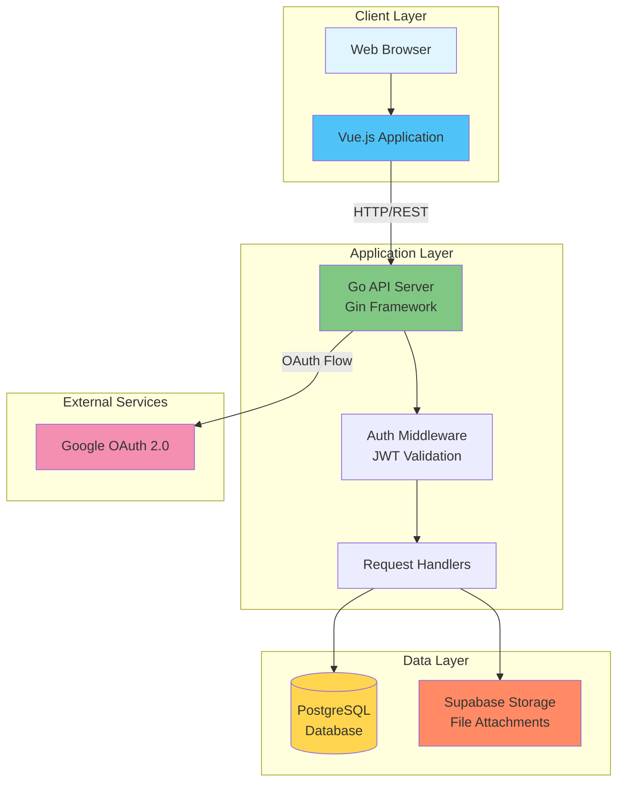

---

## Request Flow Control

### 1. Complete Request Lifecycle

This diagram shows the complete path of a request from the browser to the database and back.

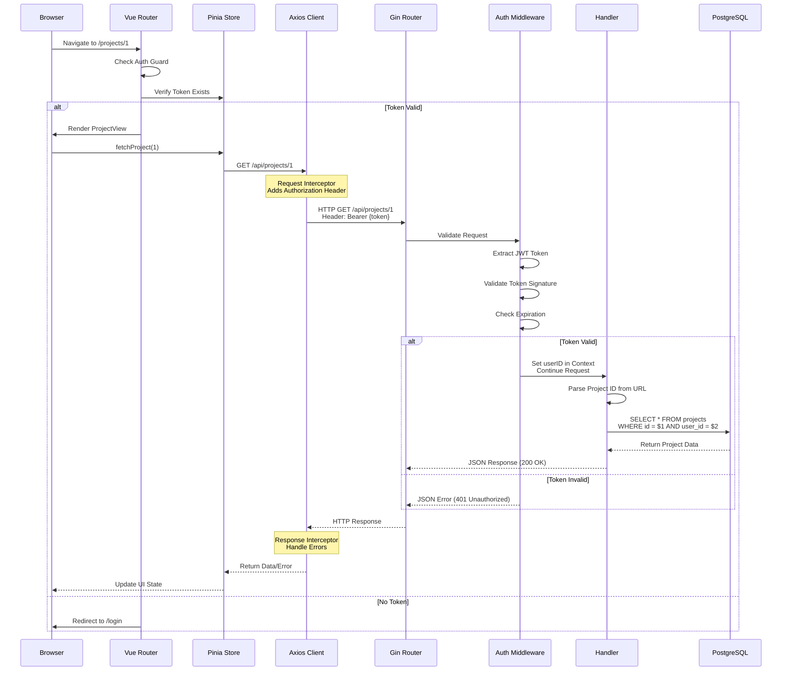

### 2. Detailed Handler Flow (Task Creation Example)

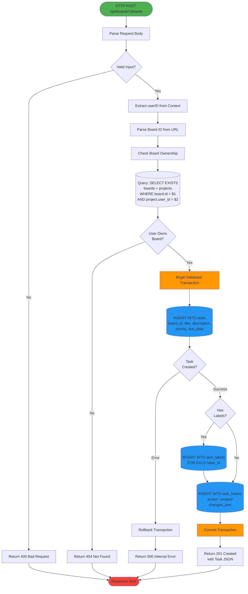

---

## Data Lineage Examples

### Example 1: Task Creation - Data Transformation Journey

Let's trace how task data flows through the system when creating a new task.

```mermaid
graph LR
    subgraph "Frontend - User Input"
        A1[User fills form:<br/>title: 'Fix bug'<br/>priority: 'high'<br/>labels: 1,3]
    end
    
    subgraph "Frontend - Vue Component"
        A2[TaskForm.vue<br/>Form Data Object]
        A3[Validation:<br/>title.length > 0<br/>priority in list]
    end
    
    subgraph "Frontend - Store"
        B1[tasksStore.createTask<br/>boardId: 5<br/>taskData: object]
        B2[API Client Request:<br/>POST /api/boards/5/tasks<br/>Body: JSON]
    end
    
    subgraph "Backend - Network Layer"
        C1[Gin Router<br/>Route Match:<br/>POST /boards/:id/tasks]
        C2[Auth Middleware<br/>Extract userID: 42<br/>from JWT token]
    end
    
    subgraph "Backend - Handler"
        D1[TaskHandler.Create<br/>c.Param id: '5'<br/>c.Get userID: 42]
        D2[Parse JSON Body:<br/>CreateTaskRequest struct]
        D3[Set defaults:<br/>priority: 'high'<br/>status: 'todo'<br/>position: 0]
    end
    
    subgraph "Backend - Database Layer"
        E1[Ownership Check:<br/>SELECT EXISTS<br/>board.id=5 AND<br/>project.user_id=42]
        E2[Transaction Start]
        E3[INSERT INTO tasks:<br/>board_id: 5<br/>title: 'Fix bug'<br/>status: 'todo'<br/>priority: 'high']
        E4[RETURNING:<br/>id: 123<br/>created_at: timestamp]
    end
    
    subgraph "Backend - Related Data"
        F1[INSERT task_labels:<br/>task_id: 123<br/>label_id: 1]
        F2[INSERT task_labels:<br/>task_id: 123<br/>label_id: 3]
        F3[INSERT task_history:<br/>task_id: 123<br/>user_id: 42<br/>action: 'created']
    end
    
    subgraph "Backend - Response"
        G1[Transaction Commit]
        G2[Build Response:<br/>models.Task JSON<br/>status: 201]
    end
    
    subgraph "Frontend - Update"
        H1[Store receives:<br/>Task object<br/>id: 123]
        H2[Add to tasks array<br/>tasks.value.push]
        H3[UI re-renders:<br/>New task card appears<br/>in board column]
    end
    
    A1 --> A2 --> A3
    A3 --> B1 --> B2
    B2 --> C1 --> C2
    C2 --> D1 --> D2 --> D3
    D3 --> E1 --> E2 --> E3 --> E4
    E4 --> F1 --> F2 --> F3
    F1 & F2 & F3 --> G1 --> G2
    G2 --> H1 --> H2 --> H3
    
    style A1 fill:#e3f2fd
    style E3 fill:#fff9c4
    style F1 fill:#fff9c4
    style F2 fill:#fff9c4
    style F3 fill:#fff9c4
    style H3 fill:#c8e6c9
```

### Example 2: Authentication Token Lifecycle

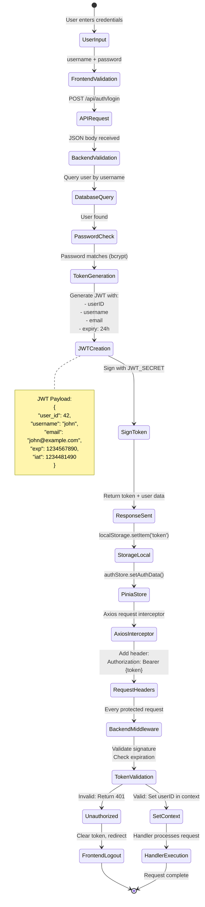

---

## Component Structure

### Backend Architecture (Go)

```mermaid
graph TB
    subgraph "Entry Point"
        Main[cmd/api/main.go<br/>Application Bootstrap]
    end
    
    subgraph "Configuration"
        Config[internal/config<br/>Environment Variables<br/>Database URL<br/>JWT Secret<br/>OAuth Credentials]
    end
    
    subgraph "Database Layer"
        DB[internal/database<br/>Connection Pool<br/>Migrations<br/>Query Execution]
    end
    
    subgraph "Middleware"
        CORS[middleware/cors.go<br/>CORS Headers<br/>Preflight Requests]
        Auth[middleware/auth.go<br/>JWT Validation<br/>Context Injection]
    end
    
    subgraph "Handlers - Business Logic"
        AuthH[handlers/auth.go<br/>Register<br/>Login<br/>Google OAuth<br/>Me]
        ProjectsH[handlers/projects.go<br/>CRUD Operations<br/>Ownership Validation]
        BoardsH[handlers/boards.go<br/>Board Management<br/>Position Ordering]
        TasksH[handlers/tasks.go<br/>Task CRUD<br/>Move Between Boards<br/>History Tracking]
        LabelsH[handlers/labels.go<br/>Label Management<br/>Color Assignment]
        CommentsH[handlers/comments.go<br/>Comment CRUD<br/>User Association]
        AttachmentsH[handlers/attachments.go<br/>File Upload<br/>Supabase Integration]
    end
    
    subgraph "Models"
        Models[internal/models<br/>Data Structures<br/>Request DTOs<br/>Response DTOs<br/>Validation Tags]
    end
    
    subgraph "Utilities"
        JWT[utils/jwt.go<br/>Token Generation<br/>Token Validation<br/>Claims Extraction]
        Password[utils/password.go<br/>Hash Password<br/>Compare Password<br/>bcrypt]
    end
    
    Main --> Config
    Main --> DB
    Main --> CORS
    Main --> Auth
    Main --> AuthH
    Main --> ProjectsH
    Main --> BoardsH
    Main --> TasksH
    Main --> LabelsH
    Main --> CommentsH
    Main --> AttachmentsH
    
    AuthH --> Models
    ProjectsH --> Models
    BoardsH --> Models
    TasksH --> Models
    LabelsH --> Models
    CommentsH --> Models
    AttachmentsH --> Models
    
    AuthH --> DB
    ProjectsH --> DB
    BoardsH --> DB
    TasksH --> DB
    LabelsH --> DB
    CommentsH --> DB
    AttachmentsH --> DB
    
    AuthH --> JWT
    AuthH --> Password
    Auth --> JWT
    
    AttachmentsH --> Config
    
    style Main fill:#4caf50
    style DB fill:#ff9800
    style Models fill:#2196f3
```

### Frontend Architecture (Vue.js)

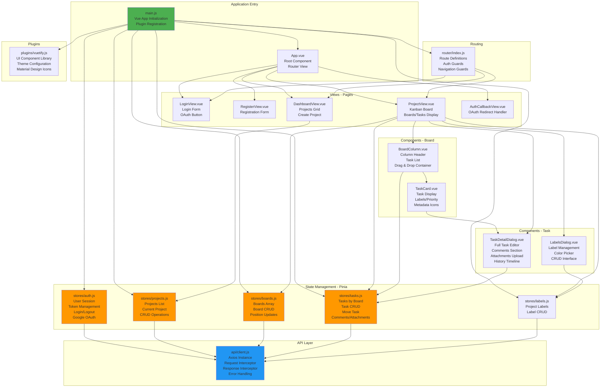

---

## Database Schema

### Entity Relationship Diagram

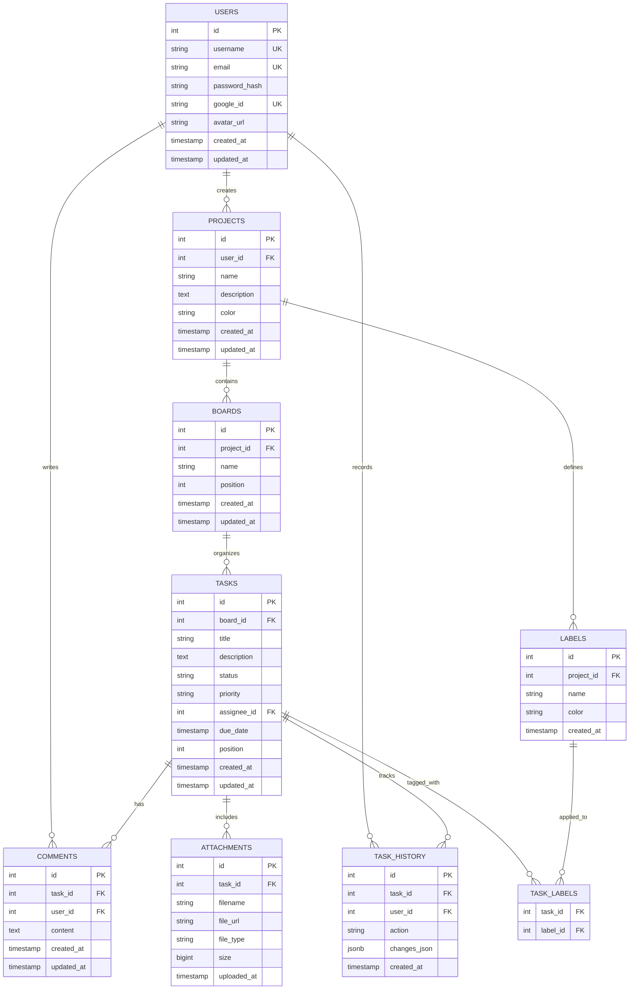

### Table Indexes and Constraints

```sql
-- Critical Indexes for Performance

-- Users
CREATE UNIQUE INDEX idx_users_username ON users(username);
CREATE UNIQUE INDEX idx_users_email ON users(email);
CREATE INDEX idx_users_google_id ON users(google_id) WHERE google_id IS NOT NULL;

-- Projects
CREATE INDEX idx_projects_user_id ON projects(user_id);
CREATE INDEX idx_projects_created_at ON projects(created_at DESC);

-- Boards
CREATE INDEX idx_boards_project_id ON boards(project_id);
CREATE INDEX idx_boards_position ON boards(project_id, position);

-- Tasks
CREATE INDEX idx_tasks_board_id ON tasks(board_id);
CREATE INDEX idx_tasks_assignee_id ON tasks(assignee_id) WHERE assignee_id IS NOT NULL;
CREATE INDEX idx_tasks_due_date ON tasks(due_date) WHERE due_date IS NOT NULL;
CREATE INDEX idx_tasks_status ON tasks(status);
CREATE INDEX idx_tasks_position ON tasks(board_id, position);

-- Task Labels (Composite for JOIN optimization)
CREATE INDEX idx_task_labels_task_id ON task_labels(task_id);
CREATE INDEX idx_task_labels_label_id ON task_labels(label_id);

-- Comments
CREATE INDEX idx_comments_task_id ON comments(task_id);
CREATE INDEX idx_comments_user_id ON comments(user_id);
CREATE INDEX idx_comments_created_at ON comments(created_at DESC);

-- Attachments
CREATE INDEX idx_attachments_task_id ON attachments(task_id);

-- Task History
CREATE INDEX idx_task_history_task_id ON task_history(task_id);
CREATE INDEX idx_task_history_created_at ON task_history(created_at DESC);
```

---

## Authentication Flow

### Complete OAuth 2.0 Flow (Google)

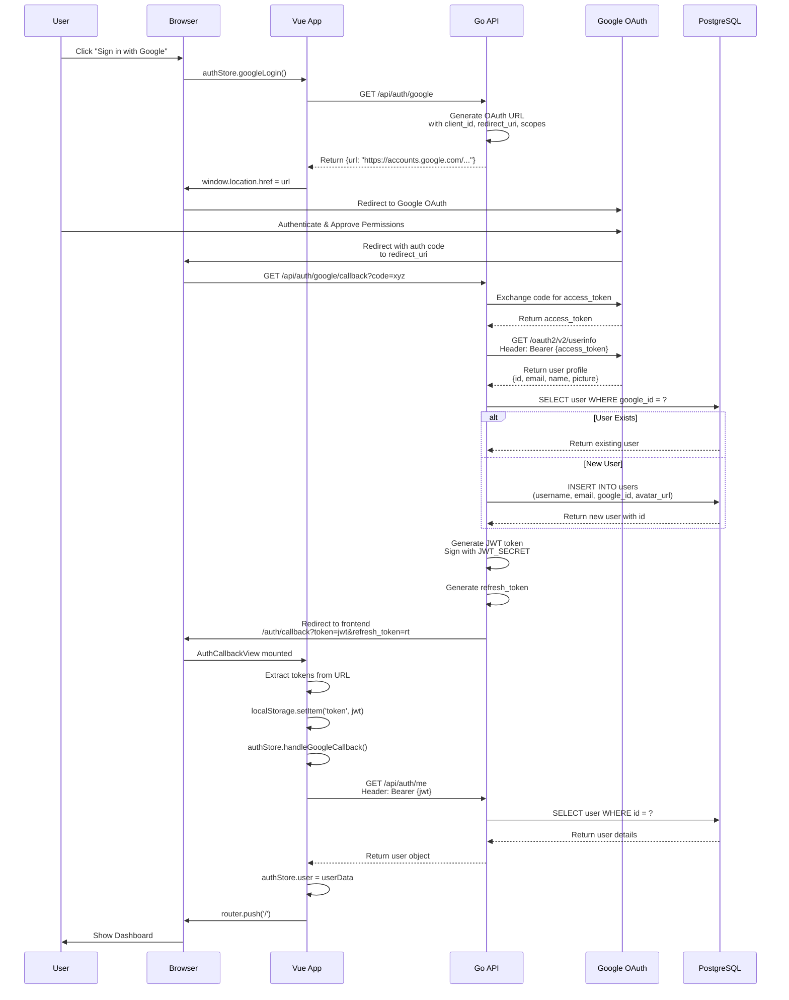

### JWT Token Structure

```javascript
// JWT Header
{
  "alg": "HS256",
  "typ": "JWT"
}

// JWT Payload
{
  "user_id": 42,
  "username": "john_doe",
  "email": "john@example.com",
  "exp": 1735689600,  // Expiration (24 hours)
  "iat": 1735603200   // Issued at
}

// JWT Signature
HMACSHA256(
  base64UrlEncode(header) + "." +
  base64UrlEncode(payload),
  JWT_SECRET
)
```

---

## API Design Patterns

### RESTful Resource Hierarchy

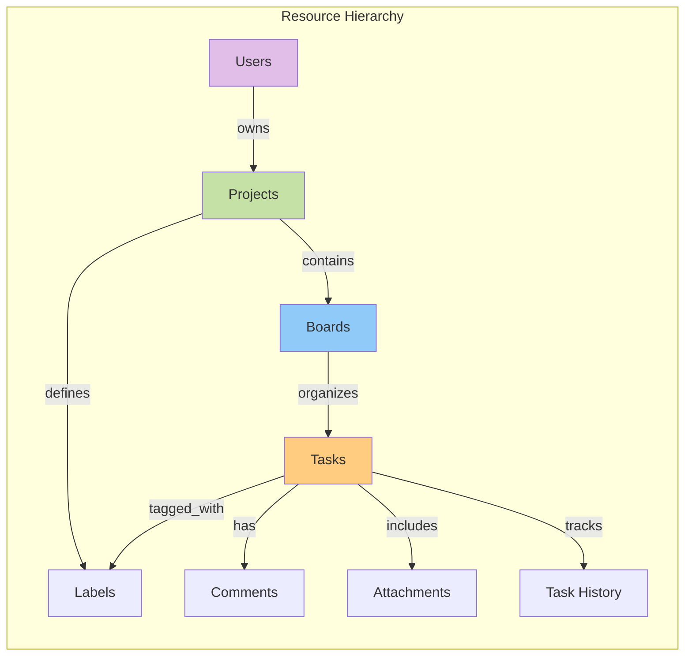

### API Endpoint Patterns

```
# Authentication
POST   /api/auth/register          # Create new user account
POST   /api/auth/login             # Authenticate user
GET    /api/auth/google            # Get OAuth URL
GET    /api/auth/google/callback   # Handle OAuth callback
GET    /api/auth/me                # Get current user [Protected]

# Projects (All Protected)
POST   /api/projects               # Create project
GET    /api/projects               # List user's projects
GET    /api/projects/:id           # Get project by ID
PUT    /api/projects/:id           # Update project
DELETE /api/projects/:id           # Delete project

# Boards (Nested under Projects)
POST   /api/projects/:id/boards    # Create board in project
GET    /api/projects/:id/boards    # List project's boards
PUT    /api/boards/:id             # Update board
DELETE /api/boards/:id             # Delete board

# Tasks (Nested under Boards)
POST   /api/boards/:id/tasks       # Create task in board
GET    /api/tasks/:id              # Get task details
PUT    /api/tasks/:id              # Update task
PATCH  /api/tasks/:id/move         # Move task to another board
DELETE /api/tasks/:id              # Delete task

# Task Sub-resources
GET    /api/tasks/:id/history      # Get task change history
POST   /api/tasks/:id/comments     # Add comment to task
GET    /api/tasks/:id/comments     # List task comments
POST   /api/tasks/:id/attachments  # Upload file to task
GET    /api/tasks/:id/attachments  # List task attachments

# Labels (Project-scoped)
POST   /api/projects/:id/labels    # Create label in project
GET    /api/projects/:id/labels    # List project labels
PUT    /api/labels/:id             # Update label
DELETE /api/labels/:id             # Delete label

# Comments (Direct access)
PUT    /api/comments/:id           # Update comment
DELETE /api/comments/:id           # Delete comment

# Attachments (Direct access)
DELETE /api/attachments/:id        # Delete attachment
```

### Error Response Format

```json
{
  "error": "Descriptive error message",
  "code": "ERROR_CODE",
  "details": {
    "field": "Additional context"
  }
}
```

### Success Response Format

```json
{
  "id": 123,
  "field1": "value1",
  "field2": "value2",
  "created_at": "2024-01-01T12:00:00Z",
  "updated_at": "2024-01-01T12:00:00Z"
}
```

---

## Step-by-Step: Creating a Task

Let's walk through the complete process of creating a task, from user interaction to database storage.

### Step 1: User Interaction (Frontend)

**Location**: `frontend/src/components/board/BoardColumn.vue`

```javascript
// User clicks "Add Task" button and types title
const newTaskTitle = ref('')

async function handleAddTask() {
  // Step 1a: Validate input locally
  if (!newTaskTitle.value.trim()) return
  
  // Step 1b: Call Pinia store method
  addingTask.value = true
  const result = await tasksStore.createTask(props.board.id, {
    title: newTaskTitle.value,
    priority: 'medium',
  })
  
  // Step 1c: Handle response
  if (result.success) {
    tasks.value.push(result.data)  // Optimistic UI update
    newTaskTitle.value = ''
  }
  addingTask.value = false
}
```

### Step 2: Store Layer (State Management)

**Location**: `frontend/src/stores/tasks.js`

```javascript
async function createTask(boardId, taskData) {
  try {
    // Step 2a: Make API call via Axios client
    const response = await apiClient.post(`/boards/${boardId}/tasks`, taskData)
    
    // Step 2b: Update local state
    if (!tasks.value[boardId]) {
      tasks.value[boardId] = []
    }
    tasks.value[boardId].push(response.data)
    
    // Step 2c: Return success
    return { success: true, data: response.data }
  } catch (error) {
    return { 
      success: false, 
      error: error.response?.data?.error || 'Failed to create task' 
    }
  }
}
```

### Step 3: HTTP Request (API Client)

**Location**: `frontend/src/api/client.js`

```javascript
// Axios request interceptor adds authentication
apiClient.interceptors.request.use((config) => {
  const authStore = useAuthStore()
  if (authStore.token) {
    // Step 3a: Add JWT token to request header
    config.headers.Authorization = `Bearer ${authStore.token}`
  }
  return config
})

// Request sent:
// POST /api/boards/5/tasks
// Headers: { Authorization: 'Bearer eyJhbGc...' }
// Body: { title: 'Fix bug', priority: 'medium' }
```

### Step 4: Backend Routing (Gin)

**Location**: `backend/cmd/api/main.go`

```go
// Step 4a: Router matches route pattern
protected.POST("/boards/:id/tasks", taskHandler.Create)

// Step 4b: Auth middleware validates JWT
protected.Use(middleware.AuthMiddleware(cfg.JWTSecret))
```

### Step 5: Authentication Middleware

**Location**: `backend/internal/middleware/auth.go`

```go
func AuthMiddleware(jwtSecret string) gin.HandlerFunc {
  return func(c *gin.Context) {
    // Step 5a: Extract token from Authorization header
    authHeader := c.GetHeader("Authorization")
    tokenParts := strings.Split(authHeader, " ")
    token := tokenParts[1]
    
    // Step 5b: Validate JWT signature and expiration
    claims, err := utils.ValidateToken(token, jwtSecret)
    if err != nil {
      c.JSON(401, gin.H{"error": "Invalid token"})
      c.Abort()
      return
    }
    
    // Step 5c: Set user context for handler
    c.Set("userID", claims.UserID)  // userID = 42
    c.Next()
  }
}
```

### Step 6: Handler Business Logic

**Location**: `backend/internal/handlers/tasks.go`

```go
func (h *TaskHandler) Create(c *gin.Context) {
  // Step 6a: Extract user ID from context
  userID, _ := c.Get("userID")  // 42
  
  // Step 6b: Parse board ID from URL parameter
  boardID, err := strconv.Atoi(c.Param("id"))  // 5
  
  // Step 6c: Verify user owns the board's project
  var exists bool
  h.db.Pool.QueryRow(ctx,
    `SELECT EXISTS(
      SELECT 1 FROM boards b 
      JOIN projects p ON b.project_id = p.id 
      WHERE b.id = $1 AND p.user_id = $2
    )`, boardID, userID).Scan(&exists)
  
  if !exists {
    c.JSON(404, gin.H{"error": "Board not found"})
    return
  }
  
  // Step 6d: Parse and validate request body
  var req models.CreateTaskRequest
  c.ShouldBindJSON(&req)
  // req.Title = "Fix bug"
  // req.Priority = "medium"
  
  // Step 6e: Set defaults
  if req.Priority == "" {
    req.Priority = "medium"
  }
  
  // Step 6f: Begin database transaction
  tx, _ := h.db.Pool.Begin(ctx)
  defer tx.Rollback(ctx)
  
  // Step 6g: Insert task into database
  var task models.Task
  tx.QueryRow(ctx,
    `INSERT INTO tasks (board_id, title, priority, status) 
     VALUES ($1, $2, $3, 'todo') 
     RETURNING id, board_id, title, description, status, priority, 
               position, created_at, updated_at`,
    boardID, req.Title, req.Priority).
    Scan(&task.ID, &task.BoardID, &task.Title, &task.Description, 
          &task.Status, &task.Priority, &task.Position, 
          &task.CreatedAt, &task.UpdatedAt)
  // task.ID = 123 (auto-generated)
  
  // Step 6h: Create history entry
  changes := map[string]interface{}{
    "action": "created",
    "title":  req.Title,
  }
  changesJSON, _ := json.Marshal(changes)
  tx.Exec(ctx,
    "INSERT INTO task_history (task_id, user_id, action, changes_json) VALUES ($1, $2, $3, $4)",
    task.ID, userID, "created", changesJSON)
  
  // Step 6i: Commit transaction
  tx.Commit(ctx)
  
  // Step 6j: Return success response
  c.JSON(201, task)
}
```

### Step 7: Database Execution

```sql
-- Step 7a: Ownership verification query
SELECT EXISTS(
  SELECT 1 FROM boards b 
  JOIN projects p ON b.project_id = p.id 
  WHERE b.id = 5 AND p.user_id = 42
); -- Result: true

-- Step 7b: Task insertion
INSERT INTO tasks (board_id, title, priority, status) 
VALUES (5, 'Fix bug', 'medium', 'todo') 
RETURNING id, board_id, title, description, status, priority, 
          position, created_at, updated_at;
-- Returns: id=123, board_id=5, title='Fix bug', ...

-- Step 7c: History insertion
INSERT INTO task_history (task_id, user_id, action, changes_json) 
VALUES (123, 42, 'created', '{"action":"created","title":"Fix bug"}');
```

### Step 8: Response Journey Back

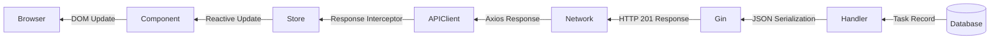

**Final Response**:
```json
{
  "id": 123,
  "board_id": 5,
  "title": "Fix bug",
  "description": null,
  "status": "todo",
  "priority": "medium",
  "assignee_id": null,
  "due_date": null,
  "position": 0,
  "created_at": "2024-01-01T12:00:00Z",
  "updated_at": "2024-01-01T12:00:00Z"
}
```

---

## Performance Considerations

### Query Optimization

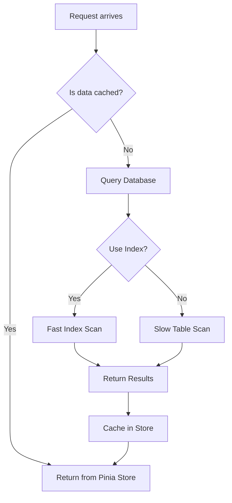

### Key Optimizations

1. **Database Indexes**: All foreign keys and frequently queried columns are indexed
2. **Frontend Caching**: Pinia stores cache API responses
3. **Optimistic Updates**: UI updates immediately before server confirmation
4. **Pagination**: Large lists are paginated (ready for implementation)
5. **Connection Pooling**: Database connection pool reuses connections
6. **Transaction Batching**: Related operations grouped in transactions

---

## Security Architecture

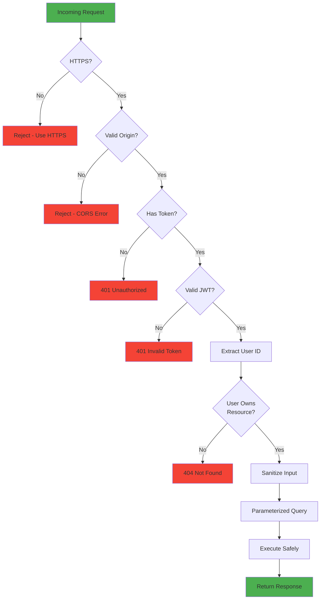

---

## Deployment Architecture

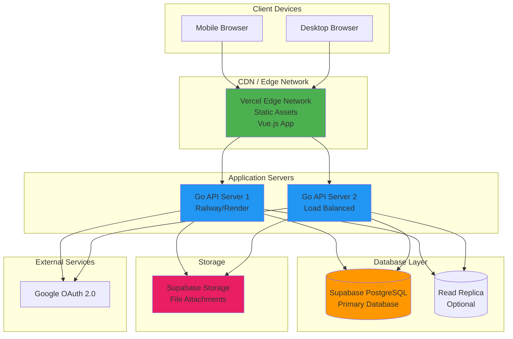

---

## Conclusion

This architecture provides:

- **Scalability**: Stateless API servers can scale horizontally
- **Security**: Multi-layer authentication and authorization
- **Performance**: Indexed queries, caching, optimistic updates
- **Maintainability**: Clear separation of concerns, modular design
- **Developer Experience**: Type-safe models, comprehensive error handling

For questions or contributions, refer to the main [README.md](./README.md) and [DEPLOYMENT.md](./DEPLOYMENT.md) files.

